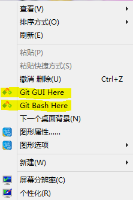
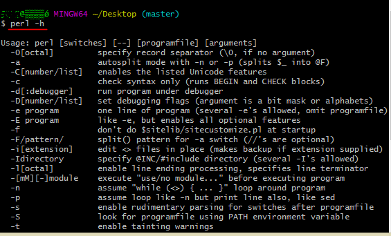

# Perl单行程序

**注**：本内容需要点的perl编程基础，最好是读过《perl语言入门》。

**本系列是自己平常学习工作中的总结，每一个实例均为我为了讲解而设置的，自己试过的，如有错误，望能见谅。**


本系列由

+ github：[eternal-bug](https://github.com/eternal-bug)
+ 简书：[白菜代码小推车](https://www.jianshu.com/u/47e00a43ceda)

编写。

## 前言

*之前在知乎上看到别人提问*

> [“你见过哪些令你瞠目结舌的Perl代码技巧?” —— 有的人说是perl可以写诗，有的人就说是perl One-Liners。](https://www.zhihu.com/question/37944158)

perl的单行程序在很多时候非常方便，而且可以实现比较复杂的功能，接下来看看它是怎么方便和强大的。

## Perl One-Liners简介

我一般就叫 Perl单行程序 ，那与平常写perl脚本有什么区别呢？

- 平常写perl脚本

```perl
#!usr/bin/perl -w

# 比如打开文件，然后读取文件，逐行打印出来
open FILE, "<", "123.txt" or die $!;
while(<FILE>){
    print $_;
}
close FILE;
```

- 使用单行程序

```bash
cat 123.txt | perl -n -e 'print $_'
```

看起来的确是简洁一些，但是实际上简练只是一方面，我的老师曾经说：

> 有的时候的确是简练，但更重要一点是 ——**“流程化”**。

什么意思呢？其实按照shell编程来看，很多时候都是**很多个工具相互搭配干活**，中间用**管道**将他们哥几个串联起来，这样一前一后这种**流程感**是不是很强烈，有木有。就是知道干了什么事情，比较清晰明白。

例如某个流程是这样：

```bash
cat --> awk --> grep --> perl

cat  读取文件到标准输入中
awk  预处理
grep 筛选
perl 个性化处理
```

同时，作为单行程序，在shell里面运行是可以利用到linux的工具的，也就是说perl也可以掺和进去，和里面的其他工具搭配干活的，比如`cat`,`echo`,`ls`,`pwd`,`last`,`find`,`ps`,`parallel`,`sed`,`grep`,`awk`等等好多工具。

对比之下有这样一些区别：

- 脚本需要写到文件中去然后才能运行，而单行命令的使用与其他命令行工具一样直接在终端或者shell中写代码或者直接复制之前的代码，之后运行就可以。
- 单行程序可以搭配众多linux工具，使用管道串联起来，形成流程处理。而编写脚本虽然可以使用反引号或者system()或者exec()可以运行linux工具，但是流程感没有那么强烈。
- 单行程序携带方便，比如在自己简书里面放一些代码，到别处只需要登陆简书复制代码就可以运行了。
- 单行程序一前一后的流程并不是固定的，不同需求的情况下通过组合流程中的不同部分可以得到需要的结果，将所有处理的过程写到脚本中更改处理顺序不方便，当然也可以把perl单行写到脚本中然后参与shell的命令行的运行也是可以的。
- 如果有的时候有些shell命令的用法你忘了，这个时候全部用perl命令行替代它的功能是可以的，就是说其实我感觉像是一些命令`sed`，`grep`，`awk`，`sort`，`wc`之类的命令的一些常见用法都可以用perl单行写出来，这样一来很多东西可以统一，但是可能不适用于单行而是适用于bash脚本了。
- 另外还有一点我忽略了，在沧浪之水v的博文[《Perl programming and perl one line》](https://www.jianshu.com/p/eaf717f852d7)里面提到了perl单行程序对于调试来说很方便，从而不需要IDE来。比如忘了某个函数的用法，你可以在单行里面直接开写，而不用写到文件里面，然后打开终端之后运行文件......

其实这样看来perl One-Liners有这么多好处，简练、流程化、可以搭配众多Linux大佬工具，那都用它得了。但是如果仅仅只是使用perl来完成所有的事情，那么将perl单行中的代码量增加很多，实际上写接近五十行代码的perl已经不适合用perl One-Liners了，因为在shell里面修改不方便，同时代码的保存也是问题。那个时候好不如写在脚本`.pl`文件里面了，同时对于使用较多模块，或者自己写包的形式就完全不适合用单行程序了。

打个比方，可能不太恰当，“perl单行程序就像是自行车，从家里哐当推出去骑着就跑；而写perl脚本就像是摩托车，从家里推车出来都要会儿时间，还得启动，有时候可能熄火；自行车最后跑起来那的确是没有摩托车快，也没有摩托车跑得远，但是它骑上去就开始跑了，轻便快捷，然后还有各种Linux工具的相互配合，进行接力！有时候胜过直接写perl脚本哦”。

|         perl单行         |        perl 脚本         |
| :----------------------: | :----------------------: |
|  |  |

好，废话少说。在之前先做一下准备工作。

首先你是用的是什么系统

## **Windows**

**说明**：做生物信息学推荐使用linux，虽然现在windows 10下面有linux子系统，可能配置某些工具的时候会出点问题。因为我写文章习惯用我的笔记本写，所以我用Windows演示。不过没有关系，我下面的这些perl代码是跨平台的。

windows下没有包含perl的解释器，你需要先下载一个[**git for windows**](https://links.jianshu.com/go?to=https%3A%2F%2Fgitforwindows.org)（不是github for windows）

或者下载一个完整版的[**cmder**](https://links.jianshu.com/go?to=http%3A%2F%2Fwww.softpedia.com%2Fdyn-postdownload.php%2Fb926b13e000a1479df0450d43614f43f%2F5aa64681%2F3ba60%2F0%2F2)

这里推荐安装git for windows（虽然cmder完整版包含了git for windows，但是cmder使用的perl单行程序来说有些差别，就是在-e参数后面不能用单引号，需要用双引号，这与Linux和Mac上就有差别了，为了统一，就使用git for windows，然后在windows中的cmd中运行perl命令行程序，只能用双引号引起来，不方便后面的操作，没有Linux命令，不利于后续的使用）
 安装好了之后，你会发现你的右键菜单多了点东西

- Git GUI Here
- Git Bash Here



右键菜单

如果没有这两个选项，就按照`C:\Program Files\Git\git-bash.exe`这个路径找

> 就我现在的理解（我刚用这个软件），就是相当于把linux的shell里面的命令搬到windows下面运行，同时也搬了perl的一些核心功能过来，所以我们就可以用这个软件来使用Linux下面的perl单行程序了！是不是很酷！

我们先试一试perl是不是在这个软件里面，我们在桌面**右键**（其实在别处也可以）（在mac或者linux系统中就打开**终端**），选择 ***Git Bash Here** 这一项（没有这一项就 `徽标 + R`调出运行面板，在里面输入`C:\Program Files\Git\git-bash.exe`）

输入  `perl -h`



perl帮助信息


 可以看到这个软件带了perl程序，帮助里面列出来的这些参数是后来要说的。

## **Mac或Linux**

Mac和Linux就干脆一些，它们自带perl，你只需要打开终端就可以，所以不需要前期准备。

## 准备写代码

经过上面的简单认识和准备之后，后面我会对几个关键的参数进行举例叙述。

**注**：**之前一直觉得在新浪博客上写不方便，现在把原文搬到简书上面了，稍微改了改，加了点内容。**

部分图片来自UI制造者。