# 生物画图大作战之基础篇

## 引言

在一些网站上可以看到这种类型的图形，比如GATK官网上面的这张图。


这张流程图其实大家可能经常看到，在生物的一些论坛或者网站里面。

首先问大家一个问题，**你觉得这个图片可以拿什么画呢？**

PhotoShop？Illustrator？CorelDraw？

上面的工具的确都可以画出来，甚至用windows的画图都能画出来，但是这里我想说用PPT！

+ 用ppt不是为了装逼，而是画这种图就够用而且还好用，因为它里面自带了很多的图形，其实在绘制上面类型的简图的时候还是比较好用的。

+ PPT是很常用的然后也是汇报常用的软件。
+ 另外可以将这种图形保存到ppt的格式中，下次还可以重复编辑和使用，而不至于像`.png`或者`.jpg`的图片那样没办法重新编辑了
+ 然后ppt的文件也是比较轻量的，不会像PS的`.psd`格式那样比较大而打开较慢。

在画这张图之前，我们需要来看看这种图的特点。

**提醒**：建议把这张图片`右键` -> `另存为`，用图片浏览器打开。

另外文中的名词与图片中元素的对应关系

| 名称         | 具体的元素位置 |
| ------------ | -------------- |
| 离心管       | 第一个元素     |
| 测序仪       | 第二个元素     |
| read信息记录 | 第三个元素     |
| gatk工具箱   | 第四个元素     |
| 变异位点信息 | 第五个元素     |

## 磨刀霍霍

在临摹这个图的时候不要想着“一口吃个胖子”，既然是重复这幅图，自然需要观察这幅图的特点，这样我们在画的才能得心应手。

+ **色彩**


首先我们观察色彩部分，其实这个颜色很明显了，就是“蓝”、“绿”、“黄”、“红”，“灰”，“黑”。

你有没有这种感觉，刚看到这张图的时候，下面这三个元素是直接吸引你的。我们来看看为什么它们就像**万人迷**一样在人海之中一下子就抓住了我们的眼球！

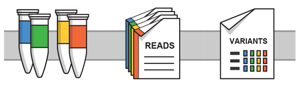

这三个元素有啥特别的？也就是“五颜六色”一些！很刺激！诶！你甭说，就是“五颜六色”让你觉得它们就算在人海之中你也能一眼找到它对吧！这个问题的答案就是因为它们的颜色。这里说到了色彩的第一个作用——**强调**元素。

另外还没完，你应该也看到了它们之间的颜色组是一样的。都包含“蓝”、“绿”、“黄”、“红”，并且都是一样的颜色。

第二个问题来了，色彩为什么这样设置呢？它们的颜色组一致，那之间肯定有联系，其实这里很明显啦！就是“不同的样品经过测序之后得到每一个样品的测序数据，之后使用GATK对综合四个样本生成综合的变异位点的信息“。这里说到了色彩的第二个功能——**关联**元素。

继续，那这张图为什么会用这些颜色呢？

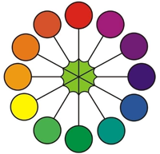

我们来看一下这个十二色盘，“蓝”、“绿”、“黄”、“红”，这四种有颜色的色彩可以说在这个圆盘上大致的均匀分布，在这种情况下，这种分布的颜色显得对比性很强。使用这四种颜色给四只离心管上色可能是为了说明样品之间是独立的，另外也可能说明了测序样品的多样性。这里说到了色彩的第三个功能——**区分**元素或者增加多样性。

其实到这里这张图的颜色主题部分就是这里，分析了大部分了，如果我们忽视上面那四种颜色的话，似乎就剩下了陪衬颜色与字体颜色呢——灰色或者黑色。

为什么其他元素不再使用有色彩的颜色呢？

之前说过，颜色是为了“强调”一些绘画中的元素，但是没有色彩难道就不强调了吗？文字描述有点单调，我们直接让我们的眼睛来看一下。

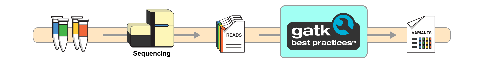

这张图是我为了显示与之前的流程图的差别，下了狠手，这下能感觉出来与原版本的差别了吗？

这里我们把之前用来填充的白色以及灰色改成了有色彩的颜色，就变成上面图中的情况，整体的造型没有任何改变，单就改变了色彩似乎这种前后的层次感以及元素的结构都给人感觉发生了变化。较多的不同色相的色彩让图没有重心点，没有线索，因为一眼看过去，无法注意某个东西，视线一直飘忽不定。说到这里其实就是想说颜色的四个作用——**引导**作用。

有色彩的颜色会让我们眼睛一眼望过去便会注意到它，另外眼睛的视线还会在这种相同的颜色上面来回的转移，这个期间眼睛会忽视那些色彩暗淡或者没有色彩的元素，比如上面的测序仪图标，其实这样恰巧将三种前后串起来，形成一个结果流程，在从左到右扫视之后就会回头查看那些陪衬元素，比如测序仪和gatk工具箱，这个时候实际上已经有了导向作用，但是流程的具体方向感还没出来，这个时候箭头派上了用场，首先将元素前后排列起来，使用灰色的箭头作为进一步的引导，于是上面的强烈流程感就出来啦，这个箭头的作用其实该在后面的结构里面说明的，但是为了一口气连贯一点，这里先说明一下。

另外，为什么箭头不用“黑色”，而是用的淡灰色呢？这里我们这个时候把先不看那些有色彩的颜色，我们再来感受一下“白色”，“灰色”，“黑色”之间的美。

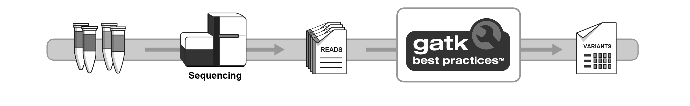

额，脑补黑白画面有点难，我把图片黑白化了一下，这个时候已经没有色彩了，先感受下。当然是与之前的有色彩的情况不一样的，但你有没有发现是不是你这个时候眼睛的注视位置和之前的有色彩的情况不一样了啊。这个时候**测序仪**和**gatk工具箱**成了我们眼睛的首先关注元素了。为什么会这样？其实一眼就看出来了，它们更“**黑**”一些，哈哈！黑色在这种情况下的确是重心，就是说原图除了离心管、测序数据、变异位点这三个图标优先级最高，剩下的就是这个测序仪和gatk工具箱了，它在这种程度下也别强调了。下面给出了我们注意到的一个程度。

```
1级关注度：离心管、READ数据、变异位置信息
+------+
|      | 2级关注度：测序仪、gatk工具箱
|      +-----+
|            | 3级关注度：灰色箭头、背景圆角方块
|            +------+
|                   |
--------------------+
```

另外不同情况下白色也会成为重心，比如下面这张照片。


这幅黑白的强烈对比让我们一下子就注意到了白色的荷花。在黑色背景的衬托下，荷花变得格外的显眼。

黑色可以是主体，白色也可以是主体，那怎么看呢，就是说周围的环境不同，就会导致主客的关系发生变化，这两者都是比较极端的颜色，所以显得突出出来了。另外在黑白灰的里面，灰色变成了过渡的、衬托的颜色，一般都是我们在看完主体部分之后眼睛才会移向客体部分，比如上面的荷花图中的荷叶（灰色）部分。

当然，如果有了颜色之后，情况可能就不一样了。

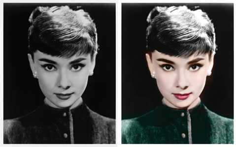

这是奥黛丽赫本[^picture]，啊，我的女神！精致的面容！

首先看左边这张黑白照片，你们首先看到的是哪里？之后哪里？

`眼珠`-> `眼部` -> `嘴唇` -> `面部` 

有没有感觉到是不是有这样的一个发散的过程呢？在这种黑白反差极其明显的情况下，白色的眼眸格外明显，之后视线才会逐步往脸部的其他地方看去。

然后看右边这幅彩色图片，你们首先看到的是哪里？之后哪里？

可能性1 ： `嘴唇` -> `眼睛` -> `眼部` -> `面部`

可能性2 ： `眼睛` ->`嘴唇` ->  `眼部` -> `面部`

到这里嘴唇的优先级提高了，因为那一抹口红，哈哈，是吧！眼睛可能还是优先级最高的，但是实际上它的色彩是黑白色的，这个与我们之前说的可能有点差别。凡事不是绝对，这里我觉得是人类的天性！就是说人第一眼会自然的朝对方的眼睛看去。

别看美女了！我们再回过头来看箭头的灰色，它的目的是为了指引整个过程，但是应该是作为陪衬而不是主体，那自然不能“喧宾夺主”，所以这里使用淡灰色即能被我们眼睛所看到起到指引作用，也不会太显眼。

小结一下，有色彩的颜色具有`强调`、`关联`、`区分`、`引导`的作用。

+ **结构**


为了查看方便，把图再放一遍

图中可以看到有五个元素——`离心管`、`测序仪`、`read信息`、`gatk工具箱`、`结构变异信息`。从左到右是一个流程，在上面说颜色的时候其实部分已经叙述了。

结构说实话就是这些什么各种形状啊什么的，这里来从结构上要重点说一下文中常说的“偷懒”是个怎么偷懒法！

首先最能引起你的注意的肯定就是那四种颜色啦！你有没有发现这四个颜色对应的东西都是矩形？也就是说它们虽然在不同的元素上的大小长短不一样，但是都属于矩形？那么最后归根结底，我们只需要画出一个方块来就OK了！这是一个“偷懒”点。具体怎么做，别着急，在后面自会揭晓。

然后你再仔细看`read数据`和`结构变异记录`，也就是第三个和第五个元素，能发现其中的规律吗？除了颜色相关之外是不是还有相同的地方？好了，我不卖关子了，其实这里的纸张形状都是一样的，只不过`read数据`元素的纸张上面多了一点边线装饰，实际上还是一个模子里出来的。所以只需要画一个纸张就可以了！这里又是一个可以“偷懒”点。

我们再来看第一个元素离心管，这个元素与之前一样，四个之间除了那抹颜色不一样，其他都是一样的啦！所以这里又是一个偷懒点。

上面这三个元素——`离心管`、`read数据`、`变异位点记录`，归根结底我们实际上只需要画三个基本组成部分就可以了，其他的装饰什么的再分别对待。

+ [x] 四个颜色方块
+ [x] 单张纸 
+ [x] 单个离心管


最后要说的就是在最下层，有一个圆角方块，其实按照流程来看这个方块是可有可无的，那么画在这里的用意是什么呢？

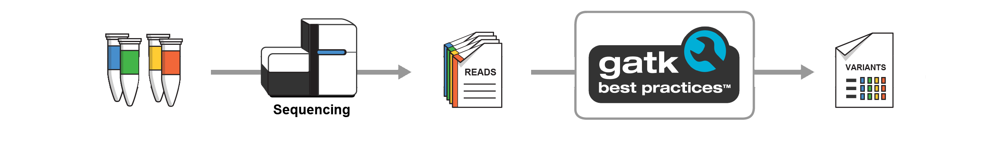

去除了后面那个大的圆角方块感觉看起来还行，并没有什么太大影响。再看看下面这个，我随便加上这个黑色的渐变椭圆，感觉咋样，是不是就像这些元素都像“悬浮”起来了，就简单的加了一个椭圆（其中的后面四个都是我“偷懒”！复制前面那个椭圆）。

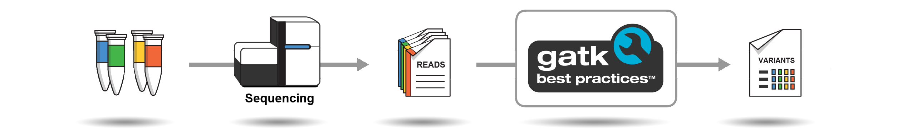

额，为了对比，我把原版图再放一遍，可以对比看看。


就是说这个方块其实在功能上与上面那个椭圆有点类似，就是说让元素**落到实处**，什么意思，上面的是悬浮的啊，也不是落在地上的啊！在加了椭圆之后，就会感知到地面或者桌面或者其他东西在这些元素的下面，是有参考的位置的，而不是像最上面的那个一样，感觉是存在于**虚空**之中，但是这个方块应该说是**锦上添花**的作用，没有它我觉得也可以。

---

从上面的图你可以看到是由这些元素哪些基本形状组成的？线？方块？圆角方块？圆锥？箭头？扳手？

其实我这里说的基本形状并不是指图中的确就存在的那个，而是将基本形状通过简单的变换就能得到的图中元素的那些基本形状。

其实这里可以说就用了三种 —— 直线、方块、圆圈。

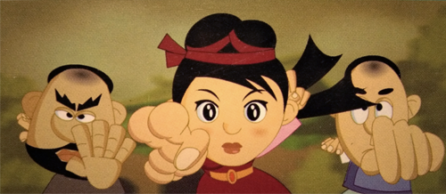

为什么这么说，因为整个过程你使用这三种元素的确就能绘制成这幅图。说到这里，就想起之前比较早的一本书《江山三侠》[^book]，作者是刘宇老师——北方之驴，驴哥啦！在这本书中作者开篇就亮出了他的绘图所用的三板斧，这个三板斧的招式有哪些呢？来看一看。作者使用了拟人化的手法来叙述这些方法。

| 大侠                | 符号 | 特点                                                         |
| ------------------- | ---- | ------------------------------------------------------------ |
| 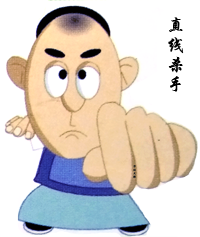 | -    | **绰号**：直线杀手 **性别**：男  **脾气**：冷酷无情  **特长**：使得一手夺命直线拳，传说没有他搞不定的轮廓线！  **三板斧招式**：`夺命直线拳` |
| 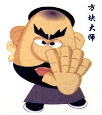 | □    | **绰号**：方块大师  **性别**：男  **脾气**：外刚内柔  **特长**：练得一手无敌方块掌功力，用方块拼凑图形的武功出神入化！ **三板斧招式**：`无敌方块掌` |
| 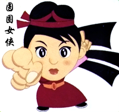 | ○    | **绰号**：圆圈女侠  **性别**：女  **脾气**：爱唠叨  **特长**：一手玉女圆圈指练得已经是炉火纯青，传说没有她用圆圈拼凑不了的东西！  **三板斧招式**：`玉女圆圈指` |

这是一个江山三侠的故事，每一个大侠掌握一门三板斧招式，刚开始都是虾兵蟹将，但是随着故事的进行，三侠所耍的三板斧招式越来越熟练，而且变化越来越多，最终打下了整个江山。在落幕的时候，作者刷刷点点写下了这些：

> 整整一本书，我始终就以“简单观察，简单理解”为原则。以“方块、圆圈、直线”为工具，以“能偷懒处且偷懒”为指导，以“三板斧耍熟了就是大侠！”为信念，以“不抛弃、不放弃，坚持到底就是有意义！”为支撑力，以“学以致用”为终极目标，一步步的就讲下来了。仔细想想，这本书的几百页内容其实也就是这么几句话！
>
> 如果你能捏着鼻子坚持看到这里，那么上面的几句话就是这本书的真正武功秘籍！十有八九你也该得到真传了！只要能领悟到我那几句话，别说学Flash了，我保证你学什么会什么，做什么成什么！
>
> 最后我祝愿各位：耍熟三板斧，纵横天下路！
>
> 好了各位，下山去吧！
>
> 2009年11月30日
> 北方之驴

我们能做点什么呢？我们回头来看看文首的GATK图能不能通过这种“**夺命直线拳**”+“**无敌方块掌**”+“**玉女圆圈指**”三板斧招法来绘制呢？下面进入我们的实战演练环节了。

## 📑 📖 

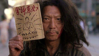

**在所有所有之前有一本📑 如来神掌要交给你，此书可保你过程中的平安！书中的内容就是📖**

>  **`ctrl+z`，后悔如此简单！**

天机不可泄露！好了，去吧！

## 小试牛刀

我们打开PPT，这里建议使用**office 2007以上**的版本或者**wps**（高版本的软件在工具栏布局以及功能上都优化啦！用起来的时候会舒服一些）。

使用**无敌方块掌**绘制四个颜色方块。就像下面这样

1. 首先点击`插入` ->`形状` -> `方块` -> `按住shift拖动鼠标得到一个方块`

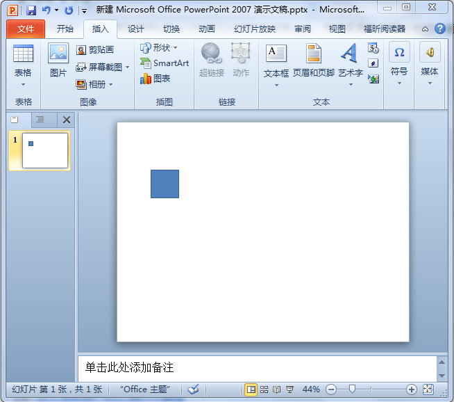

2. 然后`按住ctrl + shift`复制这个方块得到四个方块。（`ctrl`是对指定的东西拖动时候复制，`shift`是按照当前垂直或者水平方向进行移动）

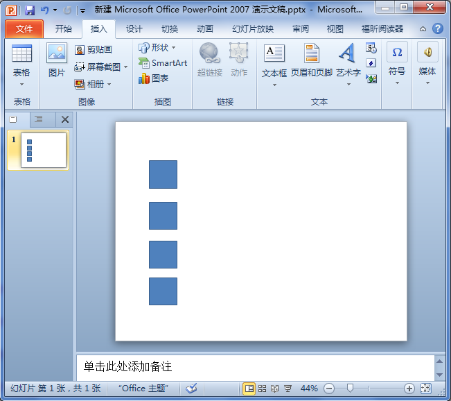

3. 将填充颜色改为上面的四种颜色——“蓝”、“绿”、“黄”、“红”，另外边框线改为黑色。（更改的方法是：对着方块`右键` -> `设置形状格式` -> `填充` -> `选择预设的颜色`）

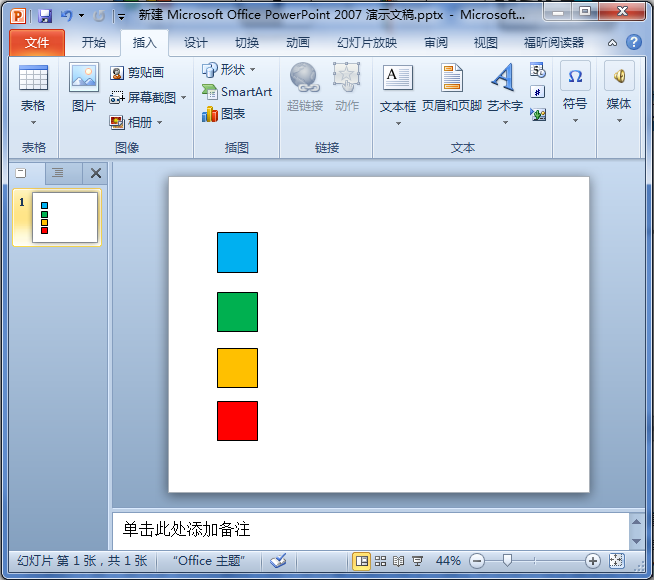

**注**：*这里我没有完全与上面的流程图中的颜色一致，而是使用的office中调色板的默认标准颜色。这样是为了大家能方便的点选颜色，而不需要去麻烦的设置那些RGB值。最后如果你自己想尽可能还原的话，可以尝试在GATK那个流程图中取色，然后记住颜色值，将这些方块的颜色改为对应的颜色也是可以的。*

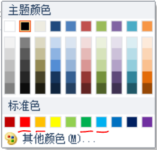

4. 然后将这些色块都框选中之后按住`shift`拖动缩放框缩小之后放在一边。

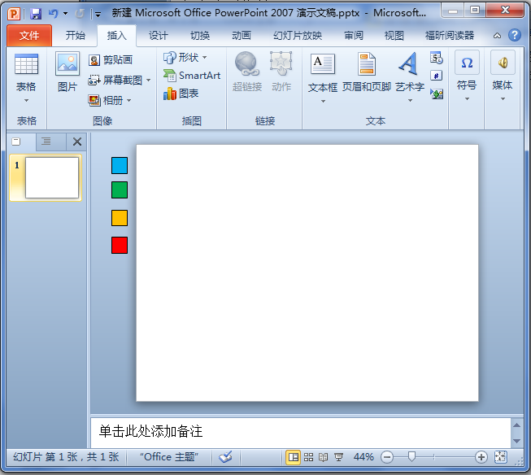

到这里其实已经完成了主要的操作了，是的，你没有搞错，这个看起来最简单的部分就是我们这个画图流程中最常用到的东西。到这里小试牛刀就完成啦！

## 再接再励

上面的小试牛刀已经得到一些方块，但是都是些最基本的元素，并没有什么特别的东西，但是别着急，到这一步我们不能止步于简单元素的绘制，我们要尝试绘制稍微复杂一点的元素。这里我们继续使用**无敌方块掌**来做方块，另外直线杀手的**夺命直线拳**也会助助兴哦！这次的**无敌方块掌**威力更加大！


这个图中，五个元素里面最好画的是它了，我们可以先试着画一下。在画之前分析一下这个元素的组成，`三角形` + `方块` + `文字`，文字都好说，所以也就是只有`三角形` + `方块`，但是`三角形`呢？它就是缺了一个`心眼`（角）的方块。所以说最后简化为 `方块`。之前的结构分析里面说过了，这里其实我们画一张折角的纸后面的东西都还做了，然后这张纸还可以用作另外的元素的绘制。额，说起来简单，我们来实战操作一下。

1. 首先画一个长方形，然后把填充色改为白色，边框改为黑色：


2. 然后画一条辅助线，然后按住`ctrl`将当前的白色方块复制一份，将它的左上角拖动到原始的方块的左上角对齐，之后缩放成如图的情况。（**可以适当的将当前的画面放大（右下角的缩放条），这样进行微调的时候就会精确一些，这个其实为了增加自己画图时候的舒适程度，在后面的讲解不会再说这个事情，你自己觉得需要放大就放大，需要缩小就缩小**）。


3. 然后`单击`小白色方块，点击菜单栏的`格式` -> `编辑形状` -> `编辑顶点`。然后对着右下角的点`右击` -> `删除顶点`。

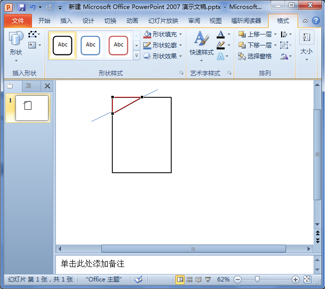

4. 然后单击一下空白处，之后再单击三角形，点击菜单栏的`格式` -> `旋转` -> `垂直翻转`。然后对着绿色的旋转棒将三角形旋转，然后微调一下。


5. 然后点击下面那个大的方块，然后同样的点击菜单栏的`格式` -> `编辑形状` -> `编辑顶点`。对着和三角形的右上角的那个位置`右键` -> `添加顶点`，然后对着左上角的点单击，然后拖动它到与三角形左边点相交的位置。


6. 删除参考线，然后，对着三角形`单击` -> `ctrl+c`复制 -> `ctrl+v`粘贴。得到两个三角形。

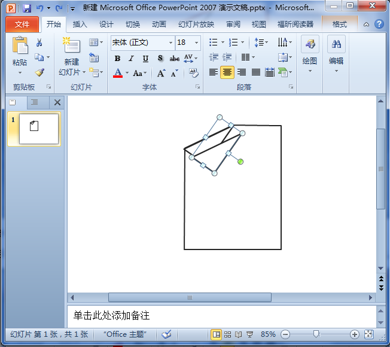

7. 单击最上层的三角形，`右键` -> `编辑顶点`。向下拖动直角顶点， 将其填充色改为淡灰色，线条颜色选择无线条。

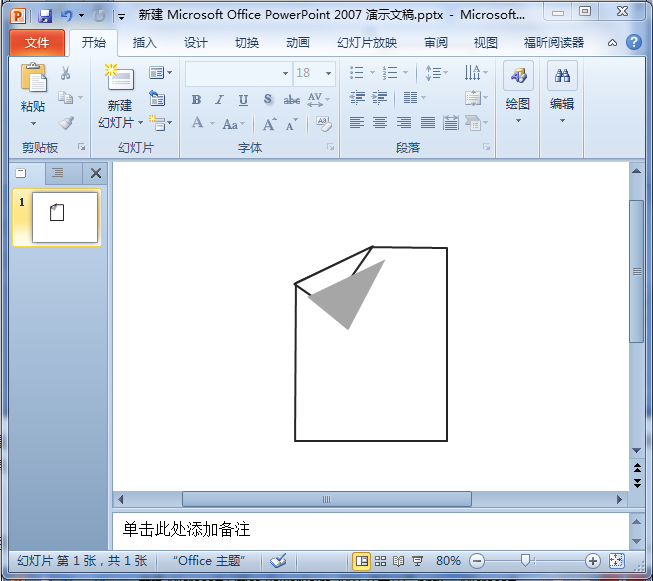

8. 对着灰色三角形下面的三角形`右键` -> `置于顶层` -> `置于顶层` 。然后移动灰色三角形的位置，期间还可以调整三角形的顶点的位置。

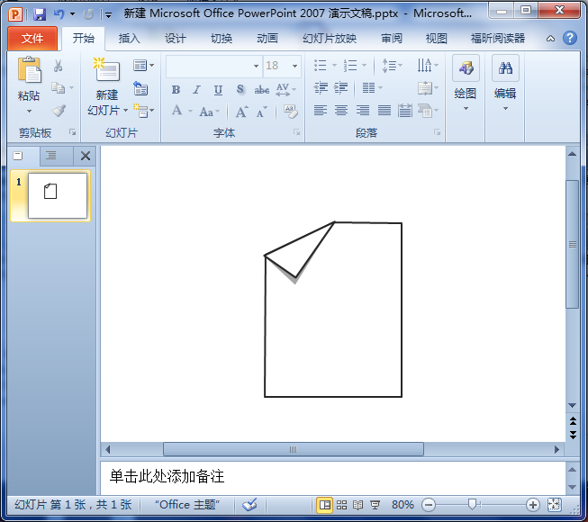

8. 然后将左边的四个色块一起选中，`右键` -> `置于顶层` -> `置于顶层` ->  按住`ctrl`拖动复制到方块上。

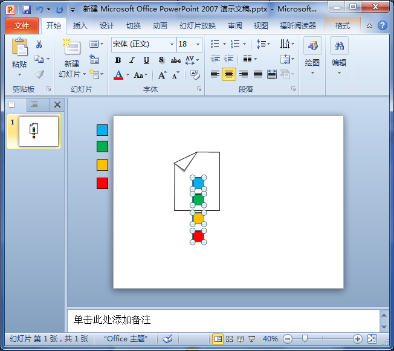

7. 对着其中一个方块的右边的缩放点将方块变为竖着的长方形，之后再次对着其中一个方块的右下角按住`shift`进行缩放。然后调整位置变成下面的样子。这里有一个好习惯，就是选中这四个方块`右键` -> `组合` -> `组合`成为一个整体。

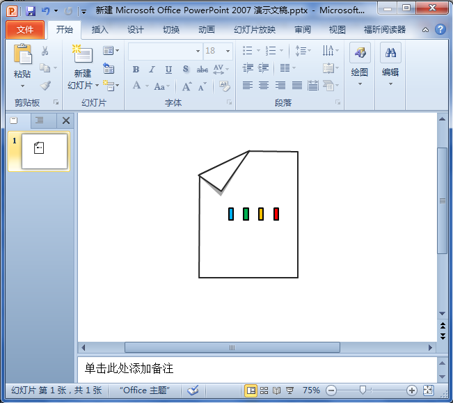

**注**：在把方块移动到一行的时候可能会对不齐，这里就需要对齐功能。为了讲解连贯，这里把对齐的方法放到了文末的`附录：对齐技巧`里面。需要的可以查看。但是这里我建议可以先不管对得齐不齐，我们先往下走，保持连贯性。后面再调整也不迟。

8. 按住`ctrl+shift`复制三份出来（如果取消了对四个方块的选择，可以按住`shift`加选四个方块），然后复制其中一个到左边，将填充色和边框色改为黑色。

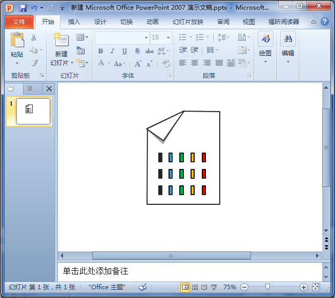

9. 然后加上英文字就OK啦，`插入` -> `文本框` -> `横排文本框`。这里字体可以用`Arial`。


到这里这张纸就完成了。

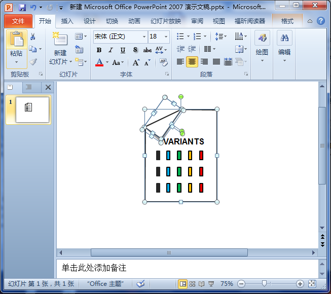

但是之前我们分析了结构的，很多元素是可以重复利用了，也就说后面可以“偷下懒”哦！看出来没，这张纸是不是前面的read数据元素也是这个。我们来把这一步的收尾工作完成。按住`shift`加选三角形和三角形阴影和方块，`右键` -> `组合` -> `组合`。


## 更进一步

上面的步骤已经得到第一个元素了，虽然相对于其他元素来说很简单，但是已经用到了后面需要用到的方法的十之七八了，我相信到这里你已经会了一些基本操作了，所后面我也不会过多的叙述这些操作的具体过程，如果你要是忘记了回过头去查看一下，次数多了自然就熟悉了。我们再来更进一步把另外两个带颜色的元素——**read数据信息**和**离心管**，绘制完成。

+ **read数据信息**

1. 将刚才组合得到的纸张按住`ctrl`复制出四份，然后全选变异信息元素`组合起来`，放在一旁。

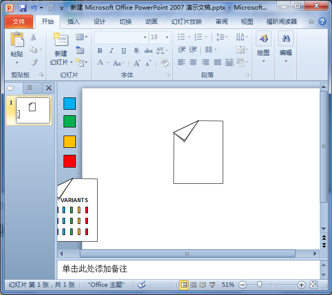

2. 然后按住`ctrl`点选左边的蓝色方块到右边的一个白纸。然后调整长宽，之后按住`ctrl`再复制一个调整好的色块，之后旋转与三角形折角的短边相贴。

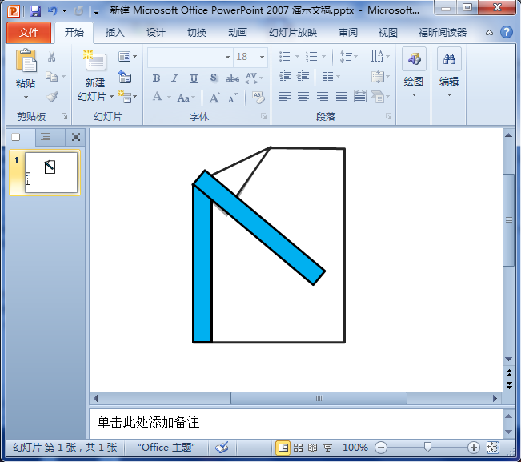

3. 之后调整位置大小以及顶点变成这样。

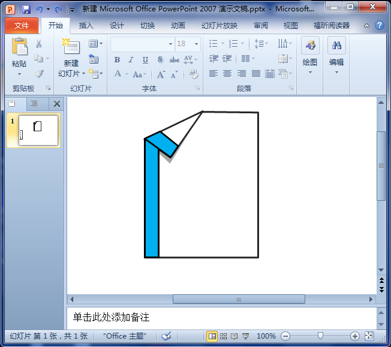

4. 画三条直线，调整颜色和宽度，增加文字。

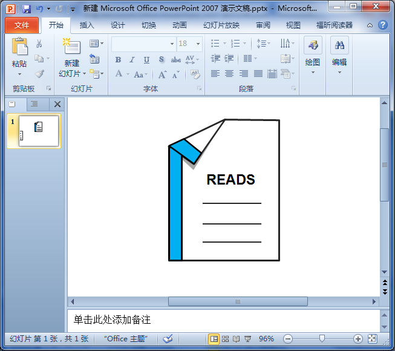

5. 框选整个图形，然后`组合起来`，之后拖动复制出来四个，然后调整侧边的颜色（因为之前组合了，所以在需要调整颜色的时候要双击进入已经组合的对象才能单独对侧边的方框进行编辑）。

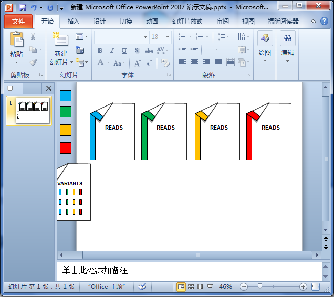

6. 按照顺序将四个纸张叠起来，之后选中四个然后`组合`。

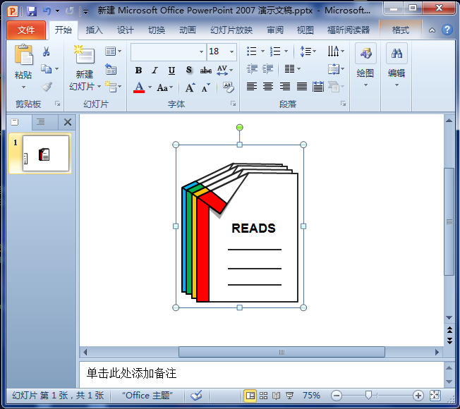

7. 拖到一边，准备绘制另外一个元素——离心管。

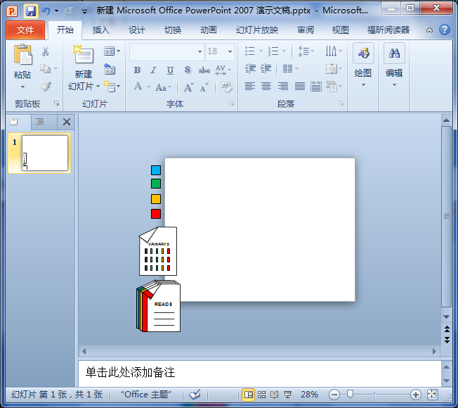

+ 离心管

离心管之前说过了，我们只需要画一个离心管，其他的复制就OK了！但是离心管与之前不同，它具有曲面的底部，这里部分细节我会详述。

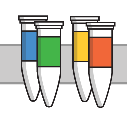

我们来观察一下这个离心管的特点，怎么灵活的使用三板斧解决它。

**盖子部分**：盖子明显可以看到它就是两个长方形平放在一起，没什么好说的。

**贴画部分**：贴画说白了就是“花一些”的长方形，没什么好说的。

**阴影部分**：为了呈现立体感，在左侧有一条灰色的阴影，注意这里我们需要用到“透明度”这个概念，之前我们都是用的不透明的颜色进行的填充，这里的阴影其实也就是方块通过变换之后调整透明度就可以了。

**管身部分**：管身部分这这一节里面的重点，也是难点，它其实就是通过**无敌方块掌**完成的，也就是通过方块的变换达到的效果。怎么做的，往下看。

1. 首先我们来画管身，是的，这次我们要“敢于直面惨淡的人生，敢于正视淋漓的鲜血”。与之前的由浅入深不同，我们上来就是要画难画的部分。

   在开始之前我们来看一张图，常见的前后的对比图啦！左边的脸庞比较圆润，右边的脸庞轮廓分明。我不多说，你自己悟一下吧啊！


2. 好了，不费话了，我们来画离心管的管身。先画三个方块，然后在画四根线，具体在下面。

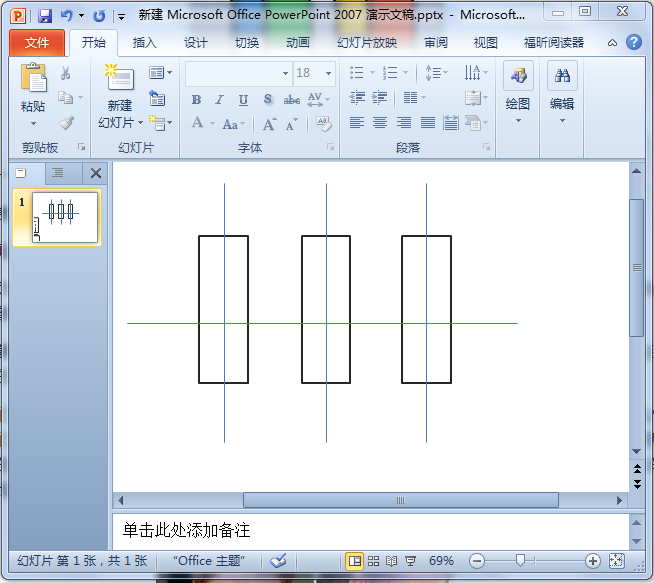

3. 然后对着中间的方块编辑它的顶点。变成下面这个样子。

   **注意**：这里的方块已经变成五个点。

   **提示**：在进入顶点编辑状态的时候再次对着图形的想要加点的地方右键可以`添加顶点`。另外，这个点的位置有的时候有点歪，可以放大现在的场景，然后细调。

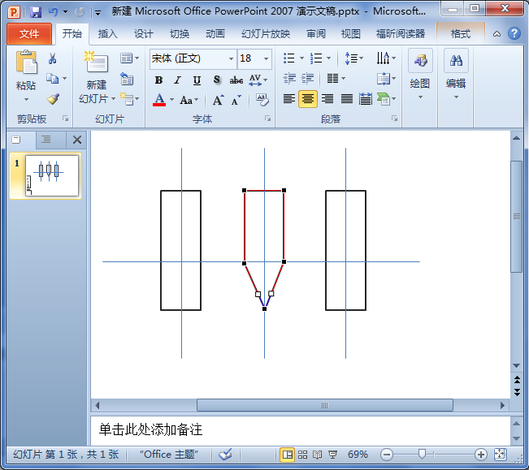

4. 然后，在右边的方块上重复第二个方块上的操作。之后注意了，开始要使用**无敌方块掌**中那闪亮的一掌了哦！你有没有发现，在每一个点的位置有两个控制（一边一个）的棒子，这个一般说`控制手柄`，不是小霸王的那个手柄🎮 啊。你可以把每一个棒子想象为一块“磁铁”，"磁铁"越长，对小球的吸引时间越长，那小球跑的路线就比较贴近"磁铁"，下坠得也越晚。就是说把手柄想象为一块"磁铁"吸引着那条线，几乎每一个顶点周围都有两条"磁铁"吸引着这条线，"磁铁"越长，线就越靠近它那边，当"磁铁"很短或者没有或者方向与线的方向相同的时候，就变成了上面我们看到的`尖点`了。

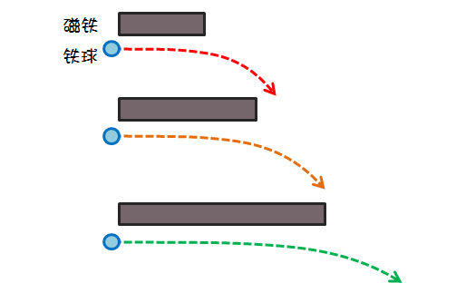

> 如果感兴趣的话，搜索一下`贝塞尔曲线`，Adobe的产品里面的钢笔工具就是这种曲线绘制的代表，ppt的这个曲线绘制体验感不行，但是对于日常我们这个绘制离心管是够用了

这个光说没有那个感觉， 我们来操作一下，首先是调管底的那一道曲线。对着管底的那个点单击，之后会出现两个控制手柄，首先我们拖动手柄的末端变成水平，之后另外一个同样也拖动到水平上，于是出现了下面最右边的形状。

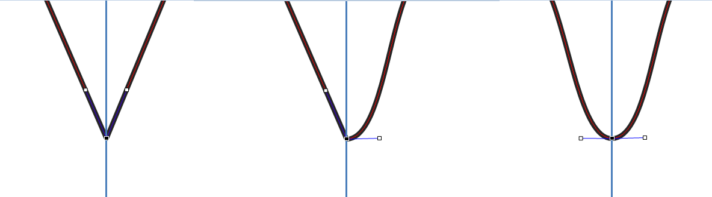

管底完成之后，之后是管身的腰部的手柄需要调整

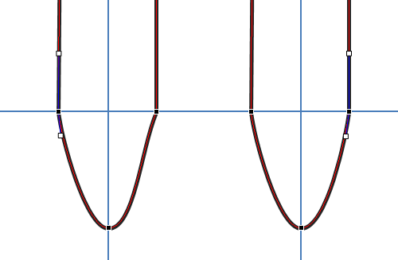

这里我们来缩小一些视野，看一下我们做了什么

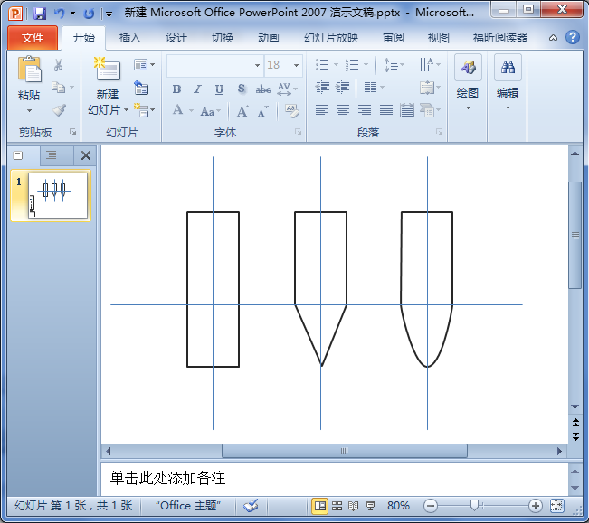

+ [x] 画一个方块
+ [x] 增加一个顶点，得到离心管管身的基本的骨架
+ [x] 将顶点变得圆滑一些

OK，管身到这里差不多啦！我们只需要管身，其他的东西可以删除了（选中按`delete`）。后面的那些加方块的细节我就不会多说了，接着来吧

5. 增加瓶盖、贴画（复制最左边的颜色方块）。

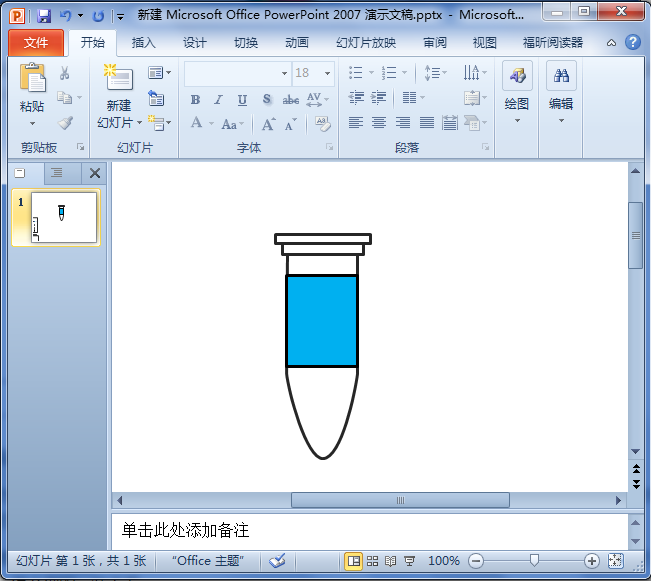

6. 差不多了，接下来画阴影（这里需要调节透明度，具体做法是`右键` -> `设置形状格式` -> `填充` -> `透明度` -> `左右调整推子来调整透明度`）。这一步需要点耐心，最后别忘了瓶盖上还有点阴影。（如果阴影不会画，可以暂时不画，以后补起来）

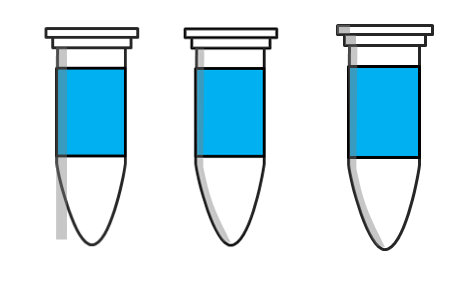

7. OK，之前说的我们只需要画一支离心管就够了，这里我们直接复制几个出来（复制之前记得`组合`哦），将贴画的颜色改一下就可以了。

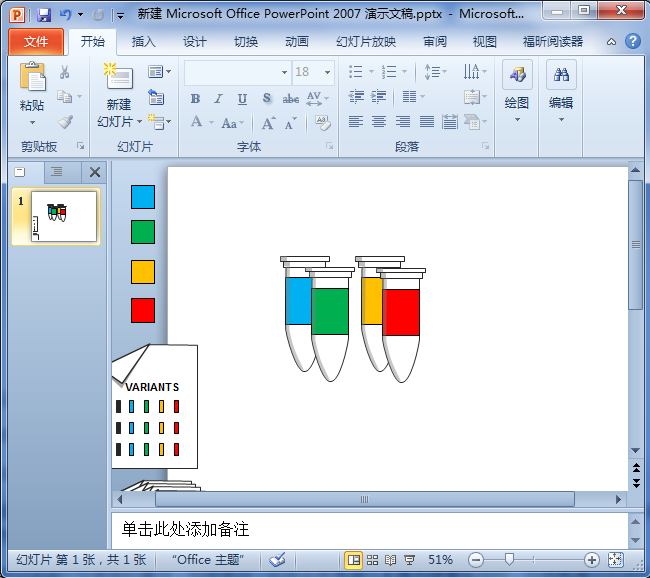

## 大显身手

其实到这里你已经具备独立完成这幅图的能力了。但是“帮人帮到底，送佛送到西”，我还是还是继续将另外两个元素绘制完成吧！

+ 测序仪

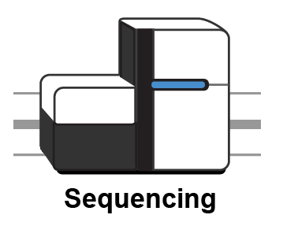

测序仪这里使用的方块是圆角方块，在PPT里面有对应的形状，不需要我们单从尖角方块来进行变换。但是这里的测序仪与之前的元素有点不一样，这个测序仪在一定程度上具有立体感。这里PPT能不能完成呢？

1. 首先要得到半边是圆角的半边是尖角的方块。画一个圆角方块（在`插入` -> `形状`里面找）。然后调整圆角的程度，那个黄色的点就是调整圆角的程度的。

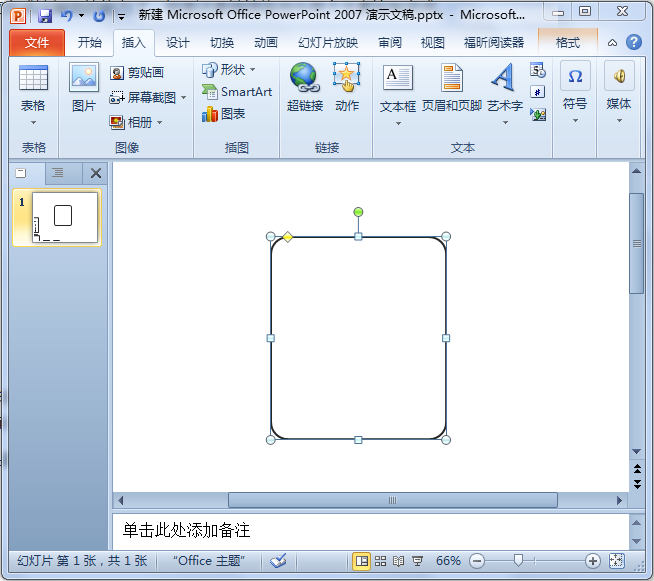

2. 然后按照下面的过程得到半边圆角半边尖角的方块。`右键` ->  `编辑顶点`，将最左侧的两个顶点删除掉，删除之后左边的两个顶点的位置是曲线，这是因为磁铁的方向与线有角度。可以这样将曲度去除，对着左边的两个角点`右键` -> `角部顶点`，两个点都要做，有时候需要点击两次。

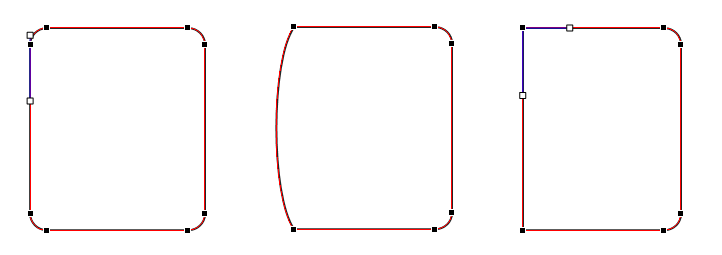

> **话外篇**：这里你可以注意一下圆角方块的实现原理是什么，就是在四个角的地方，原来普通方块每一个角就只有一个点控制，现在是由两个点控制，当每个角的点之间的距离变短的时候，你会看到方块的圆角化很明显，到最后之间没有距离的时候，那会变成什么形状呢？你应该猜到了吧

那接下来怎么得到立体的图形呢？这里有一个技巧哦！要注意看啊，

3. 把之前的半边圆角方块按住`ctrl`复制一下。

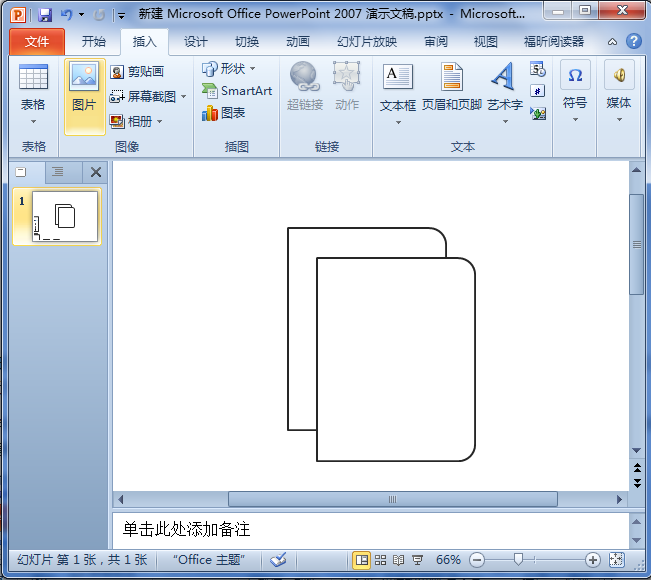

4. 然后搞两个盖子给他盖上。上面一块白色的盖子，侧面一块深灰色的盖子，顶点的样子已经在后面展示出来了。感觉有点像小时候用过的火柴，哈哈！

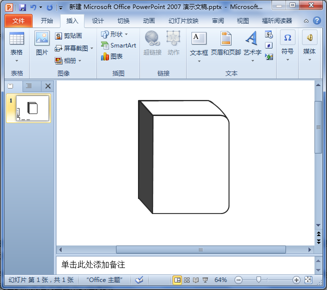

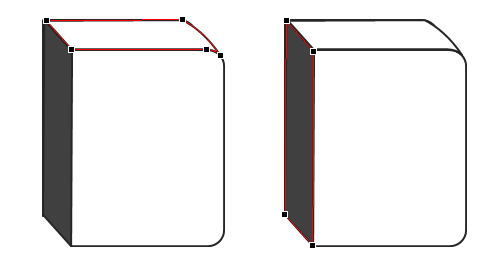

5. 加上装饰。

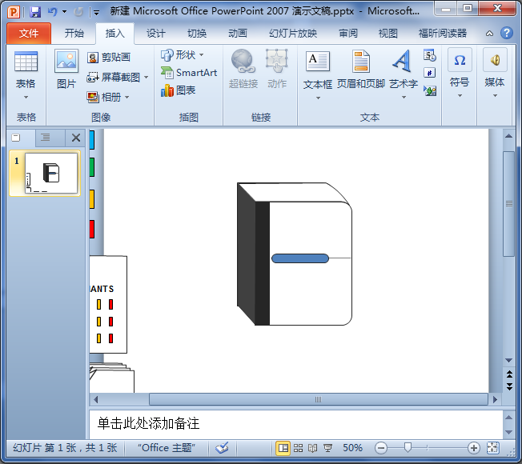


6. 继续，把左半边画出来。同样，这里有偷懒的地方，我不告诉你。

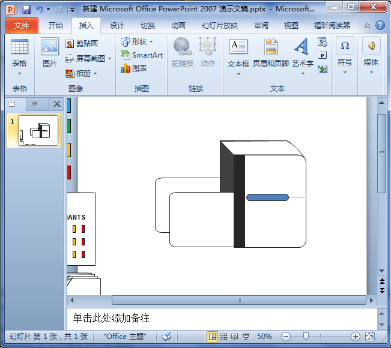

8. 其他没什么好说的，继续。

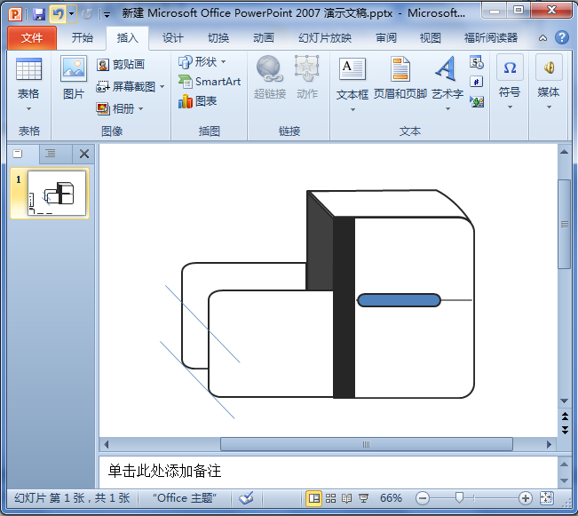

9. 好了，直接画出来吧！

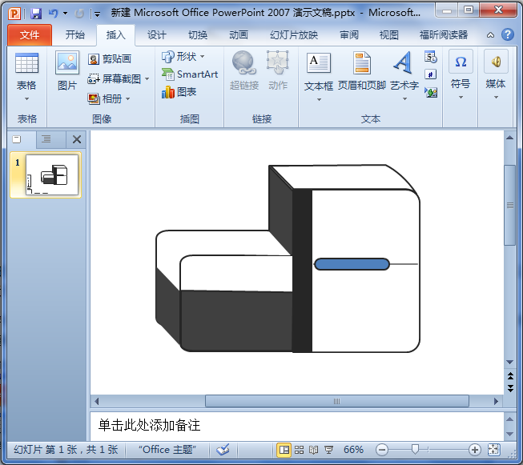

画完啦！最后一个偷懒点，在左边这个测序仪上面有一块盖板，不需要画的太好。只需要遮住右边的箱子的侧边就ok啦！

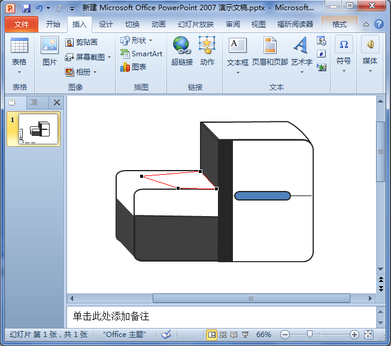

说实话，我总觉得我这个测序仪怎么画的矮胖矮胖的。

+ gatk工具箱

最后这个其实是最容易画的，除了那个扳手~。到这里**玉女圆圈指**我们要使一使了！你可别想着拿**无敌方块掌**来练习📘 玉女心经，小心走火入魔。


1. 测序仪先丢一边，我们的绘画的地方不要太杂乱，不然可能会互相干扰。我们三下五除二，尽快搞定。首先画一个圆角矩形，复制改填充色。

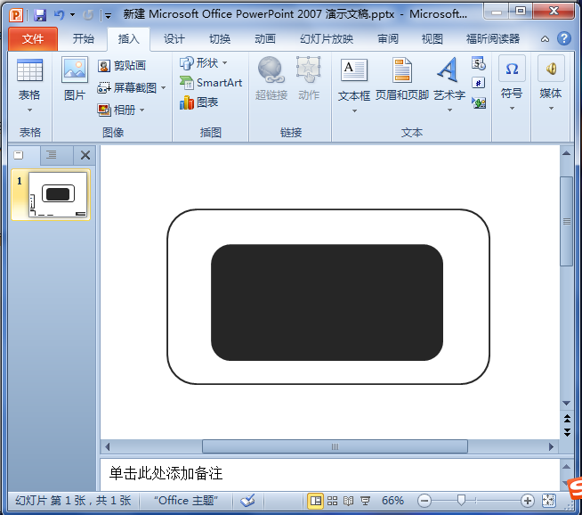

2. 画一个大圆，黑色，复制一下，蓝色，变小，然后叠到一起，移动到黑色圆角方块的右上角。

   **提醒**：在画圆的时候按住`shift`是画一个正圆。

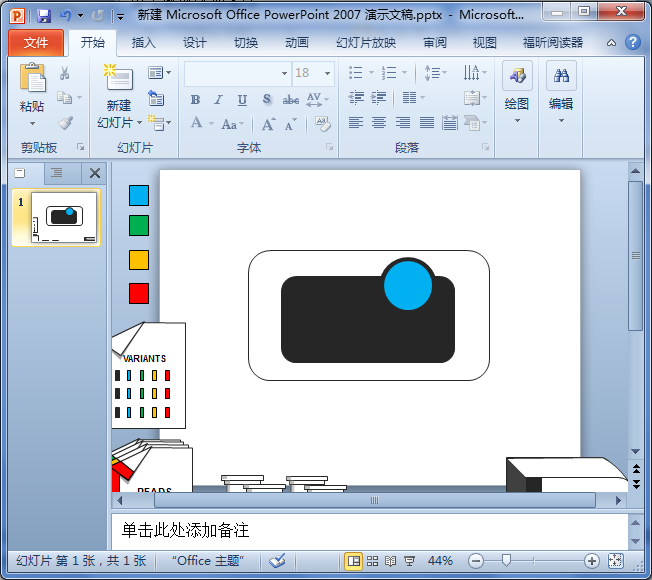

3. 加上文字。不知道图片里面的字体，这里我随便选的，`Arial black`。`TM`商标不需要调什么上标什么的，ppt里面好像没有，这里直接新建一个文本框写就可以了，字小一点。

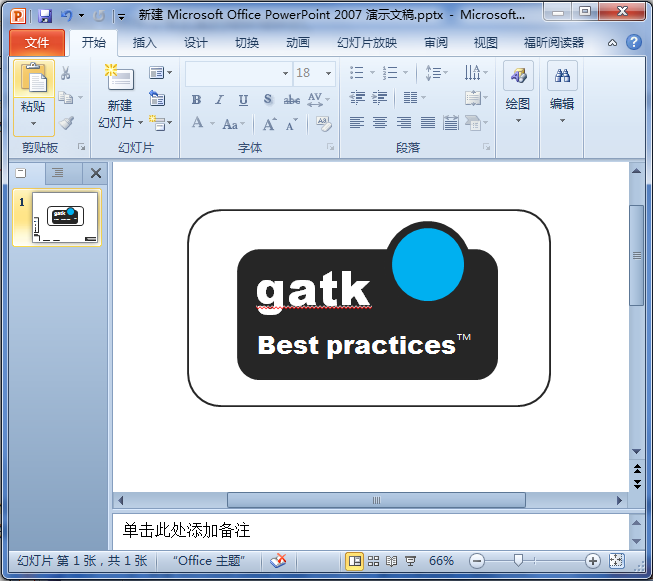

4. 还有个扳手，你要是不想画就在网上搜一个[扳手图标](http://image.baidu.com/search/index?tn=baiduimage&ps=1&ct=201326592&lm=-1&cl=2&nc=1&ie=utf-8&word=%E6%89%B3%E6%89%8B%E5%9B%BE%E6%A0%87)。然后用ps或者ppt裁剪一下放进去。这里还是说一下怎么画。

   **【选做】**这里扳手稍微麻烦一点，可以放一个扳手图标在ppt里面作为参考。这个扳手可以用一个方块就可以变出来，但是不方便，这里比较好的是用两个方块变化。

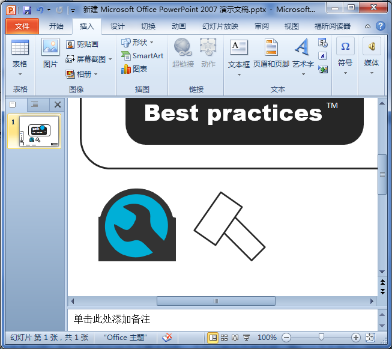

5. 添加一些顶点，便于变形

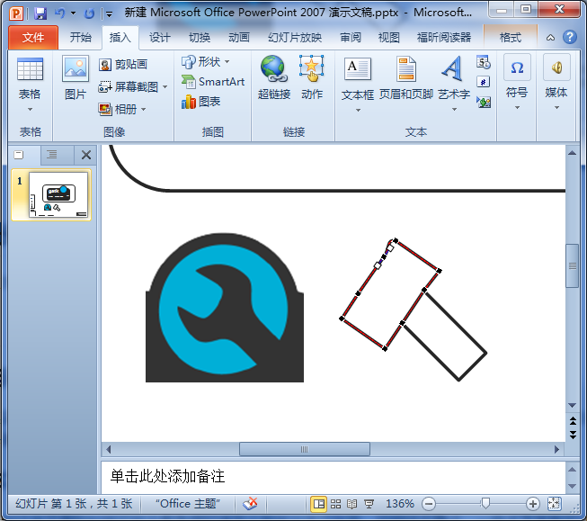

6. 移动顶点，得到基本的骨架

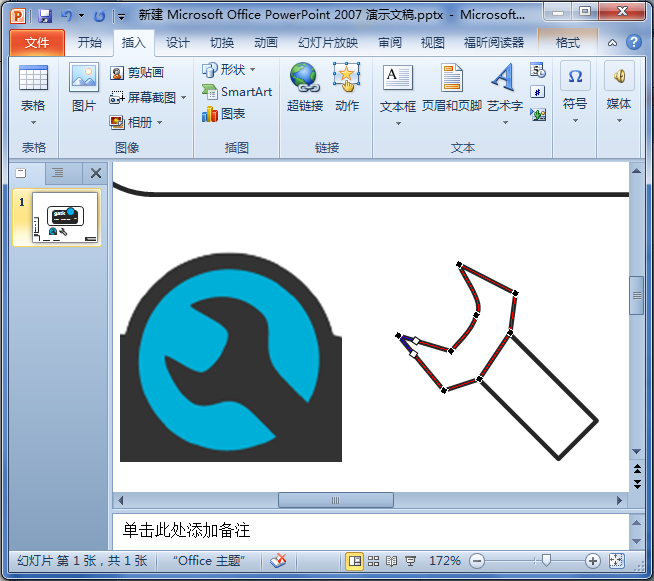

7. 扳手外形得到

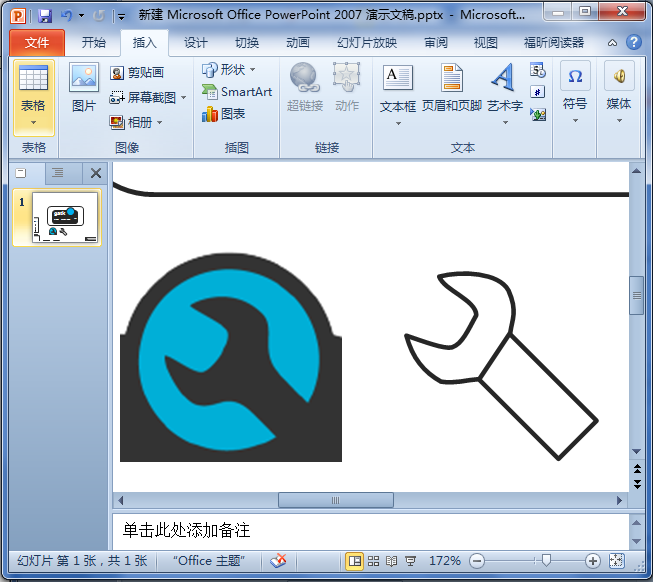

8. 调节把手部分

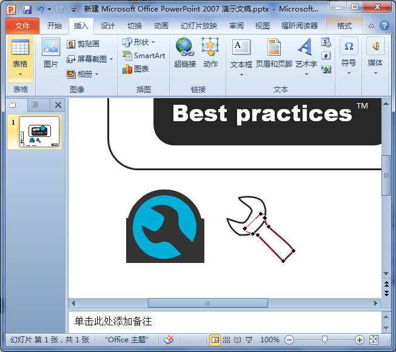

9. 完成

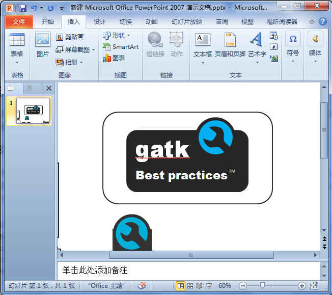

+ 组合起来

到了最后的激动人心的时刻。将它们喊到一起打麻将啦！那些箭头和背景圆角方块我就不说了，到了这里那就不是问题了！

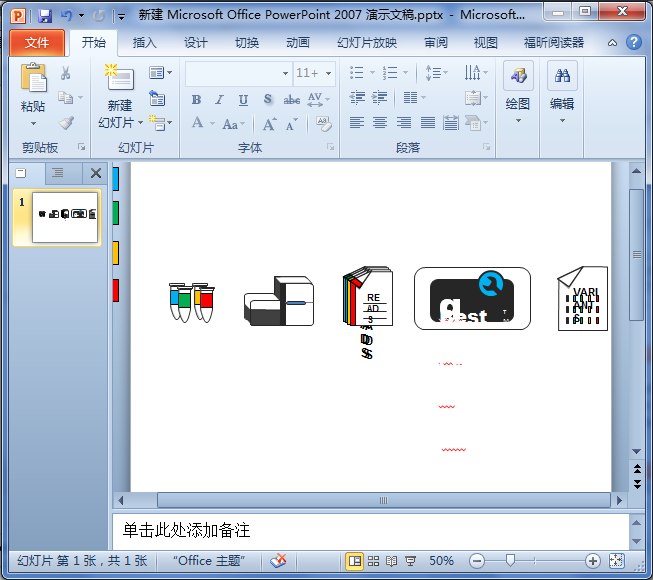

到最后一步竟然变成这样了！难道功亏一篑？说实话这一点我之前真没有意识到。那又能怎样呢？难道自己还真的放弃了？改一下不就行了！

> **提醒**：这一点我是觉得ppt画图的短板，就是`边框线`和`文字`不能随着元素的放大缩小而变化，它一直就是那么大。

取消组合改一下文字大小，之后再组合！（不取消组合也可以，双击进入到组合内部进行编辑，对着文字`ctrl+a`可以选择整个文字）调好之后OK啦！

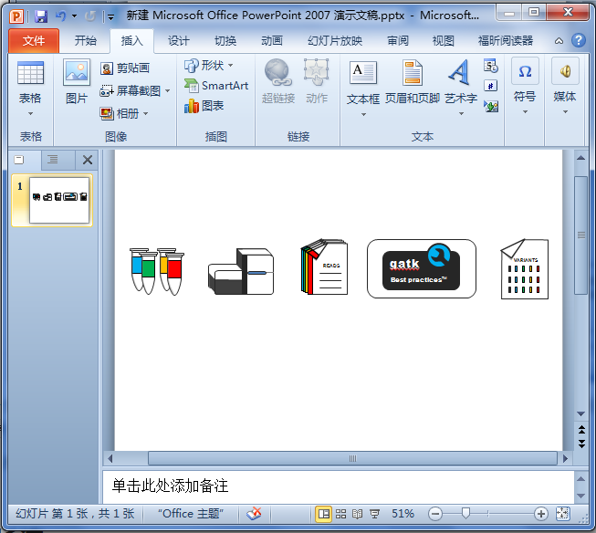

接下来画背景的东西。有现成的箭头，别老想着用**方块掌**，能偷懒就偷懒！因为我为了截图的时候中心突出，而没有使用ppt的最大化显示，这里为了让图标可见，之间的距离拉得比较近，不然按照原本的比例，那图标就需要放得很小，截图后看不清。

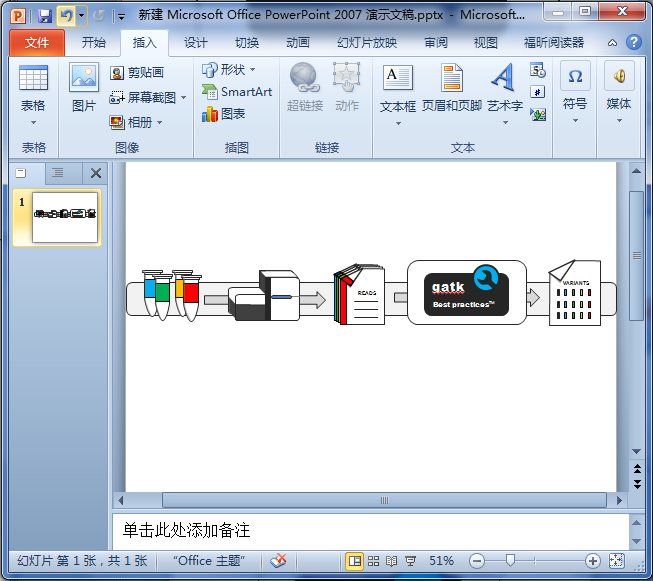

## 细水长流

说实话，这次并不是100%的还原，其实还有一些细节我们有说到或者注意到，这里可以再继续修改一下。然后以后如果有些绘制什么流程图或者其他的简单的图可以尝试使用ppt来绘制一下，多试几次那个贝塞尔曲线就会变得熟悉起来，之后就喜欢用它了。

在最开始我说了一些什么颜色啊结构啊！其实我自己还是个门外汉，色彩搭配很复杂，不是三言两语可以说的好的，这些狠多是看点书然后凭着我自己的感觉说的，每一个人的感觉不同，那你可能对于我说的就有一些不一样的见解，我觉得是好事。但是如果你是刚开始的话，下面的一些简单说法可能是有用的，也可能是错的：

+ 在自己的功力等级不高的时候，画图中的颜色的种类不要用得太多，太多容易迷人眼，不是说不能用，而是太多会让图的重点难以把握。
+ 为了**突出**你的重点，使用颜色。如果是黑白的图片，那就使用更黑的或者更白的颜色。
+ 那些装饰最好不使用有色彩的颜色（可以少用一点，比如图中的测序仪中间的圆角矩形），但是如果和其他元素有关联，最好使用和元素一样的颜色，同时需要调低颜色的鲜艳度，不可**喧宾夺主**。
+ 颜色不是随便用，如果不同元素之间有相同的颜色或者颜色组，需要考虑它们之间是否有**相关性**。
+ ppt中的中文字体尽量使用`黑体`或者`微软雅黑`，英文使用`Arial`，也就是所谓的**非衬线体**。
+ ppt中自带很多形状，这些形状很多有编辑功能，我们在绘画的时候要善于使用这些来**偷懒**。
+ 工具是用来帮助我们的，而不能让工具成为我们的负担。
+ 尽量让自己尝试一下Photoshop进行简单的图片拼接和裁剪，那样会让工作更方便快捷。
+ 软件的会与不会不是取决于掌握的程度。如果你用它完成了事情，那你就会。

另外推荐一本书[《写给大家看的设计书》](https://www.baidu.com/link?url=nzAs5ZHtoUxfTXDZ9EsQbvb-aH2UrOhF75cNSR8y1_agqf5xVDp8nGQRAEKL_K3Te474cqbWlLF_jMs1H-HseK&ck=6760.1.75.337.332.341.324.201&shh=www.baidu.com&sht=50000022_hao_pg&wd=&eqid=c49b31de00014dba000000035c852561)

## 后记

其实我觉得这个画图和编程其实是有点相似的地方的，编程一个几百行的代码，由多个模块，多个函数组成。这里拿ppt绘图也是一样，每一个元素由基本单元组成。于是就说到了那句话

> 万丈高楼从地起，归根结底就是砖

其实在看到这类文章的时候可能会着急想知道怎么能画出来这张图，按照什么路子，一路走下来就可以画出来。每个房子虽然用的砖一样，但是结构不一样，同样的房子就需要不同的图纸，不同的建筑过程。自己了解了每一个步骤的作用就可以自己去组合去完成不一样的流程之后可以自己新创建流程。

### 为什么要偷懒？

你应该注意到了，我在文中会常提到“偷懒”这个词语，额，有人可能会说，哼！什么玩意啊！教人学坏！这难道不是与我们现在的社会主义核心价值观不符啊！你这个傻逼玩意！&#！&%！&#&！

后面的话我不说了。咳！为什么说“偷懒“？我想说的是个人的精力有限，你要是孙猴子拔毛就来这么多哥们，那你当我没说。偷懒在本文中其实大部分就是复制，这有两点好处，一使可以保证相似的元素之间大小形状一致，二是可以快速的画出一组图形来。在平常做ppt的时候常常需要偷一下懒。

> 比如有人做PPT汇报工作，想把PPT做的很完美，在汇报头天晚上还在努力绘图，结果快天亮的时候，发现还有几页PPT的说话没有整理清楚呢？光记得画图了，忘了汇报怎么说啦！第二天汇报的时候满屏幕的高端大气的元素，刚开始给人感觉很好，但是随着汇报的深入那些精美的图形似乎成了主角，你成了配角，大家都去看那些图形了，没有人注意你的存在......到后来，PPT汇报结束之后，大家可能会说你的PPT做的真好！但是一问哪里好，可能就是说，哇，你的那副画，那个流程图好棒啊！能教我吗！

当然这可能是个和妹子交流的好机会，但是没有人会说你的PPT“讲”得好，个人认为 讲得好 > 做得好。PPT做出来狠多是演示用的，所以还是需要讲述。

### 为什么自己画啊，模板、插件那么多？

现在网上有很多高手设计的ppt模板，更多都很漂亮高端大气，但是我觉得有些我自己hold不住，自己把控不了，也就是说我和它不合适，所以自己尝试画一些简单的图标，这样一来可以理清自己脑子的思路，二来可以使得部分东西更加直观可视，第三，增加自己的绘图熟练度。

现在有一些优秀的PPT插件，比如`slide`，等等，那个图片库里面很多类似于这种的图形，有些很漂亮，很多我现在根本画不出来，但是这也不妨碍我画这些简单的东西啊！别人活得比我好，难道我要去屎？

说到这里我又想起之前看到的一个问题

> 谷歌、百度上什么都有，还学那么多干嘛！

## 参考

[^book]: [《江山三侠：Flash短片轻松学》 作者：刘宇 出版：社电子工业出版社 出版时间： 2010年4月1日 ](https://baike.baidu.com/item/%E6%B1%9F%E5%B1%B1%E4%B8%89%E4%BE%A0%EF%BC%9AFlash%E7%9F%AD%E7%89%87%E8%BD%BB%E6%9D%BE%E5%AD%A6/15166747)

[^picture]: [奥黛丽赫本 - 黑白照片补色 - 站酷](https://www.zcool.com.cn/work/ZMjM0NjMzNzY=.html?switchPage=on)

+ [梁景红谈色彩设计法则](https://book.douban.com/subject/26348041/)

**目前还在学习中，如果有什么错误望能告知，如需转载，请注明出处。**
